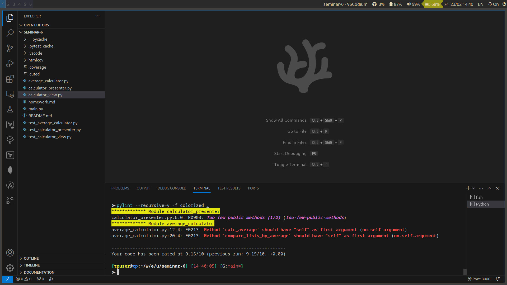

Тестирование проведено с помощью uinttest.
Модули:
1. calculator_view.CalculatorView - класс взаимодействия с пользователем(UI, консольный). Покрыт тестами в классе TestCalculatorView. Тесты:

    -   на работоспособность ввода пользователем массива целых чисел;
    -   на работоспособность вывода пользователю сообщения о вводе массива с некорректными значениями с последующим выбросом исключения;
    -   на сообщение пользователю о вводе массива с некорректными значениями;
    -   на отображение пользователю сообщения.

2. average_calculator.AverageCalculator - класс, вычисляющий средние значения и сравнивающий их. Покрыт тестами в классе TestAverageCalculator. Тесты:
    
    -   на ошибочные данные: на вычисления подан не список;
    -   на ошибочные данные: на вычисления подан список нулевой длины;
    -   на корректность вычисления средних значений одного списка;
    -   на корректность сранения вычисленных средних значений.

3. calculator_presenter.CalculatorPresenter - класс, реализующий связь логики и UI. Покрыт тестами в классе TestCalculatorPresenter. Тесты:
    
    - на проверку корректности взаимодействия UI и логики, в случае когда среднее значение первого списка больше среднего значения второго списка. Проверяется количество вызовов функций, аргументы, отображаемое пользователю сообщение; 
    - на проверку корректности взаимодействия UI и логики, в случае когда среднее значение первого списка меньше среднего значения второго списка. Проверяется количество вызовов функций, аргументы, отображаемое пользователю сообщение;
    - на проверку корректности взаимодействия UI и логики, в случае когда среднее значение первого списка равно среднему значению второго списка. Проверяется количество вызовов функций, аргументы, отображаемое пользователю сообщение.

[Отчет о покрытии тестами кода: 94%](htmlcov/index.html)

Скриншот вывода pylint
